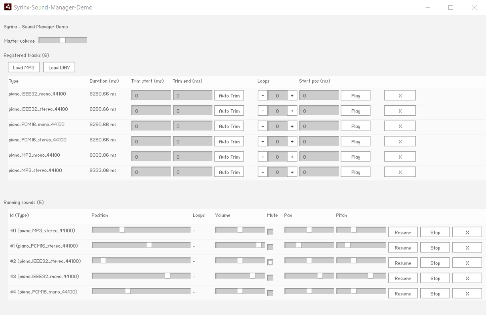

# Syrinx - Sound Manager - Demo

by Aurélien Da Campo ([Adolio](https://twitter.com/AurelienDaCampo))

## 📍 Introduction

The demo shows the main features provided by the *Syrinx Sound Manager* extension for Adobe AIR.

This demo relies on [Starling Framework](https://github.com/Gamua/Starling-Framework) & [Feathers UI](https://github.com/BowlerHatLLC/feathers).

## 🎶 Resources origin

### Sounds
- [Steinway cinematic phasing intro piano](https://freesound.org/people/XHALE303/sounds/440931/) by [XHALE303](https://freesound.org/people/XHALE303/) - This sound is licensed under the [Attribution Noncommercial License](https://creativecommons.org/licenses/by-nc/3.0/).

## 🔨 How to build?

Install [Visual Studio Code](https://code.visualstudio.com/) and [ActionScript & MXML](https://as3mxml.com/#install-extension) and then follow the build procedure provided by the *ActionScript & MXML* extension.